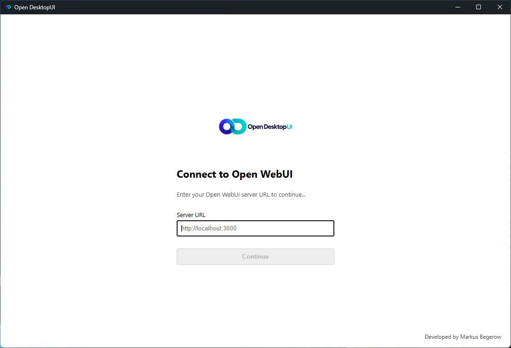
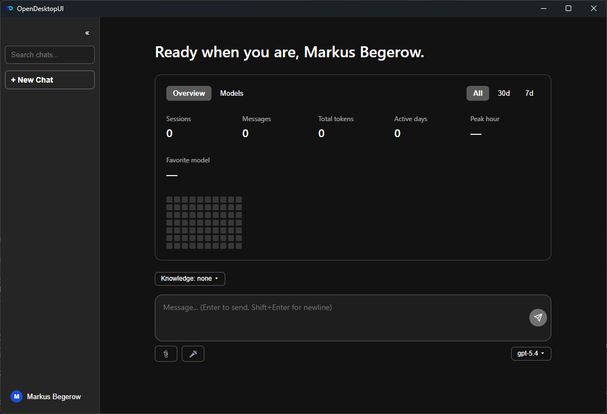

# Open DesktopUI

<div align="center">


**Claude Desktop, but for your own self-hosted Open WebUI server**

[](https://github.com/markusbegerow/opendesktopui/actions/workflows/release.yml)

[Screenshots](#screenshots) • [Features](#features) • [Installation](#installation) • [Getting Started](#getting-started) • [Development](#development) • [Known Limitations](#known-limitations)

</div>

---

A native, cross-platform desktop chat client that talks directly to your own **Open WebUI** server's REST API - not an embedded webview of Open WebUI's own frontend. It combines a fully custom React chat UI with **oikb**, Open WebUI's incremental Knowledge Base sync tool, so folders, GitHub repos, Confluence spaces, S3 buckets, Zotero libraries, and 40+ other source types can be kept in sync with your Knowledge Bases from right inside the app.

## Screenshots

<table>
  <tr>
    <td></td>
    <td></td>
  </tr>
  <tr>
    <td align="center">Sign in</td>
    <td align="center">Home</td>
  </tr>
</table>

## Features

### 💬 Chat
- Streaming responses straight from your Open WebUI server (no cloud middleman)
- Drag-and-drop or picker-based **file attachments** (documents + images), uploaded and referenced in the conversation
- **Voice input**: push-to-talk or click-to-toggle, transcribed via your own server - no third-party cloud speech service involved
- Per-message actions: copy, edit-and-resend, regenerate, read-aloud, and thumbs up/down feedback
- Pin, mark unread, archive, and group conversations; open any chat in its own window
- Export a conversation as Markdown, or your whole local history as JSON
- Push a local conversation into your Open WebUI account as a real chat, or copy a shareable link to it
- Light/dark/system theme, adjustable chat text size, collapsible sidebar

### 📚 Knowledge Base Sync (powered by [oikb](https://github.com/open-webui/oikb))
- Add local folders (and 40+ other source types oikb supports) as sync sources for your Open WebUI Knowledge Bases
- Per-source sync interval, one-click manual sync, live status and history
- The app manages the oikb daemon for you - no separate terminal window to keep open

## Requirements

- Windows 10/11, macOS 11+, or a modern Linux desktop
- A running [Open WebUI](https://github.com/open-webui/open-webui) server you have a URL and account for
- For Knowledge Base Sync specifically: Python 3.11+, [uv](https://docs.astral.sh/uv/), and a local checkout of [`oikb`](https://github.com/open-webui/oikb) - see [Known Limitations](#known-limitations)

## Installation

**Prebuilt installers**: grab the latest `.msi`/`.exe` (Windows), `.dmg` (macOS), or `.deb`/`.rpm`/`.AppImage` (Linux) from the [Releases page](https://github.com/markusbegerow/opendesktopui/releases).

Installers aren't code-signed (see [Known Limitations](#known-limitations)), so your OS will warn you on first launch - that's expected, not a sign of a bad download. It's completely fine to run anyway:

- **Windows**: SmartScreen will say "Windows protected your PC" - click **More info**, then **Run anyway**.
- **macOS**: Gatekeeper will refuse to open it normally - right-click (or Control-click) the app and choose **Open**, then confirm in the dialog that appears. (Alternatively, run `xattr -cr /Applications/OpenDesktopUI.app` in Terminal.)
- **Linux**: no equivalent warning - nothing extra to do.

You only need to do this once per install.

**From source**: see [Development](#development) below.

## Getting Started

1. Launch the app and sign in with your Open WebUI server's URL and your account (or paste a static API key for SSO-only servers, in Settings → Account).
2. Pick a model and start chatting from Home, or create a new chat from the sidebar.
3. To sync Knowledge Bases: open Settings → Knowledge, point it at an `oikb` checkout, and add a source folder.

## Development

```bash
git clone https://github.com/markusbegerow/opendesktopui.git
cd opendesktopui/apps/desktop
npm install
```

```bash
npm run dev              # Vite dev server only (frontend, no Tauri window)
npm run tauri dev        # full app: Rust build + Vite + native window, with HMR for the frontend
npm run build             # tsc typecheck + vite build (frontend production bundle)
npm run tauri build       # full native installer for your current OS
npx tsc --noEmit          # typecheck only
```

Rust side, from `apps/desktop/src-tauri/`:

```bash
cargo check
cargo build
```

There's no configured lint or test runner yet - `tsc --noEmit` and `cargo check` are the correctness gates in practice. See [`docs/RELEASING.md`](docs/RELEASING.md) for how the cross-platform release pipeline works.

### Project structure

```
oikb-desktop/
├── apps/desktop/       # the Tauri app - React/TS frontend (src/) + Rust backend (src-tauri/)
├── oikb-main/          # oikb Python project, vendored unmodified as an external dependency
├── packaging/          # PyInstaller packaging for bundling oikb as a sidecar (not yet wired up)
└── docs/               # additional docs (release pipeline, etc.)
```

## Known Limitations

- **Installers aren't code-signed.** There's no plan to buy a Windows/Apple code-signing certificate right now - see [Installation](#installation) above for the (one-time, per-install) steps to run the app anyway.
- **The oikb sidecar isn't bundled into the packaged app yet.** Knowledge Base Sync needs a separate `uv` install and an `oikb` checkout on your machine (pointed at from Settings → Knowledge) - it isn't a zero-setup feature out of the box today.
- **Local data isn't encrypted at rest.** Chat history and settings are stored as a plain SQLite database and JSON file on disk (path shown in Settings → Account → Data).
- **Two Open WebUI integrations are best-effort, not verified against every server**: pushing a conversation into your Open WebUI account ("Open in Open WebUI" / "Share Link") and message feedback (thumbs up/down) both call endpoints whose exact request/response shape was inferred from Open WebUI's general API conventions, not confirmed live against every version. If either doesn't work against your server, please [open an issue](https://github.com/markusbegerow/opendesktopui/issues) with what you see - everything else in the app (chat, models, knowledge bases, sign-in, file upload, transcription) has been verified against a live server.

## Contributing

Contributions are welcome!

1. Fork the repository
2. Create your feature branch (`git checkout -b feature/amazing-feature`)
3. Commit your changes (`git commit -m 'Add amazing feature'`)
4. Push to the branch (`git push origin feature/amazing-feature`)
5. Open a Pull Request

`oikb-main/` is vendored unmodified - please don't send PRs that edit its Python source directly; changes there belong upstream at [open-webui/oikb](https://github.com/open-webui/oikb).

## License

This project is licensed under the **GPL-3.0** - see [`LICENSE`](LICENSE) for the full text. The vendored `oikb-main/` subtree keeps its own **MIT** license (see [`oikb-main/LICENSE`](oikb-main/LICENSE)) - it's an unmodified external dependency, not covered by this project's license.

## Acknowledgments

- The [Open WebUI](https://github.com/open-webui) team, for Open WebUI itself and for `oikb`
- The [Tauri](https://tauri.app) team, for making a native desktop shell this pleasant to build

## 🙋‍♂️ Get Involved

If you encounter any issues or have questions:
- 🐛 [Report bugs](https://github.com/markusbegerow/opendesktopui/issues)
- 💡 [Request features](https://github.com/markusbegerow/opendesktopui/issues)
- ⭐ Star the repo if you find it useful!

## ☕ Support the Project

If you like this project, support further development with a repost or coffee:

<a href="https://www.linkedin.com/sharing/share-offsite/?url=https://github.com/markusbegerow/opendesktopui" target="_blank">  </a>

[](https://paypal.me/MarkusBegerow?country.x=DE&locale.x=de_DE)

## 📬 Contact

- 🌐 [Website](https://www.markus-begerow.de)
- 🧑‍💻 [LinkedIn](https://linkedin.com/in/markusbegerow)
- 💾 [GitHub](https://github.com/markusbegerow)
- ✉️ [Twitter](https://x.com/markusbegerow)
